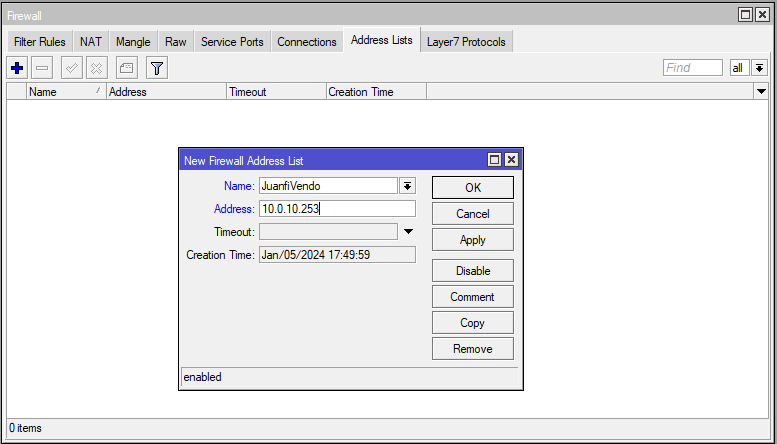
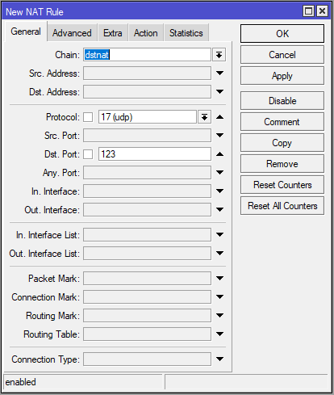

# 🕐 Fix 1970 Time Bug


This guide helps you fix the **1970 timestamp issue** on your Vendo machines. This problem occurs when Vendo devices fail to synchronize with the correct NTP (Network Time Protocol) server, causing them to revert to the Unix epoch (January 1, 1970). This issue can affect sales records, logs, and system operations.

:::info
**Required Knowledge:** Basic MikroTik firewall configuration
**Estimated Time:** 10-15 minutes
:::

---

## Prerequisites

Before starting, ensure you have:
- ✅ Access to MikroTik RouterOS admin console
- ✅ All Vendo IP addresses ready
- ✅ Understanding of your network setup

---

## Step 1: Add Your Vendo to the Address List

First, you need to create an address list for all your Vendo machines. This allows the firewall to identify and manage Vendo traffic.

> **📌 Note:** Complete this step for **all of your Vendo machines**

**Configuration Details:**
- **Name:** `JuanfiVendo`
- **Address:** `<vendo_ip_address>`

For detailed instructions, see **[Using Address List for Vendos](./vendo-address-list.md)**



---

## Step 2: Add NTP Server Firewall Rule

This step redirects all NTP (time sync) requests from your Vendo machines to Google's public NTP server, ensuring accurate time synchronization.

:::tip
**Why 216.239.35.12?** This is Google's public NTP server. It provides reliable and accurate time synchronization globally.
:::

### Option A: Using Terminal Command (Recommended)

Copy and paste this command into the MikroTik terminal:

```bash
/ip firewall nat add action=dst-nat chain=dstnat dst-port=123 protocol=udp src-address-list=JuanfiVendo to-addresses=216.239.35.12 to-ports=123
```

**What this command does:**
- Intercepts UDP packets on port 123 (NTP) from Vendo devices
- Redirects them to Google's NTP server (216.239.35.12)
- Ensures time synchronization for all Vendo machines

### Option B: Manual Configuration

If you prefer to configure through the GUI, set these parameters:

| Parameter | Value |
|-----------|-------|
| **Action** | `dst-nat` |
| **Protocol** | `17 (UDP)` |
| **Destination Port** | `123` |
| **Source Address List** | `JuanfiVendo` |
| **To Addresses** | `216.239.35.12` |
| **To Port** | `123` |



---

## Step 3: Restart Your Vendo Machines

After adding the firewall rule, restart all your Vendo machines to apply the new time configuration.

:::warning
**Important:** The Vendo must be restarted for the new NTP configuration to take effect. Without restarting, the old time settings will persist.
:::

**Steps to restart:**
1. Navigate to each Vendo device's admin panel
2. Click the **Restart** or **Reboot** button
3. Wait for the device to fully boot up (typically 2-3 minutes)
4. Verify the system time is now correct


---

## Verification

After completing all steps, verify the fix:

✅ **Check system time** on Vendo devices - should display current date/time
✅ **Verify sales records** - timestamps should be accurate
✅ **Check MikroTik logs** - should show NAT rules applied successfully

---

## Troubleshooting

| Issue | Solution |
|-------|----------|
| **Time still shows 1970** | Confirm Vendo was restarted after adding firewall rule |
| **Vendo can't access NTP** | Check firewall rule is in `dstnat` chain, verify source address list is correct |
| **Multiple Vendo have wrong time** | Ensure all Vendo IPs are in the `JuanfiVendo` address list |

---

## ✅ Complete!

Your Vendo machines should now have accurate time synchronization. Monitor them for the next 24 hours to ensure the fix persists.
