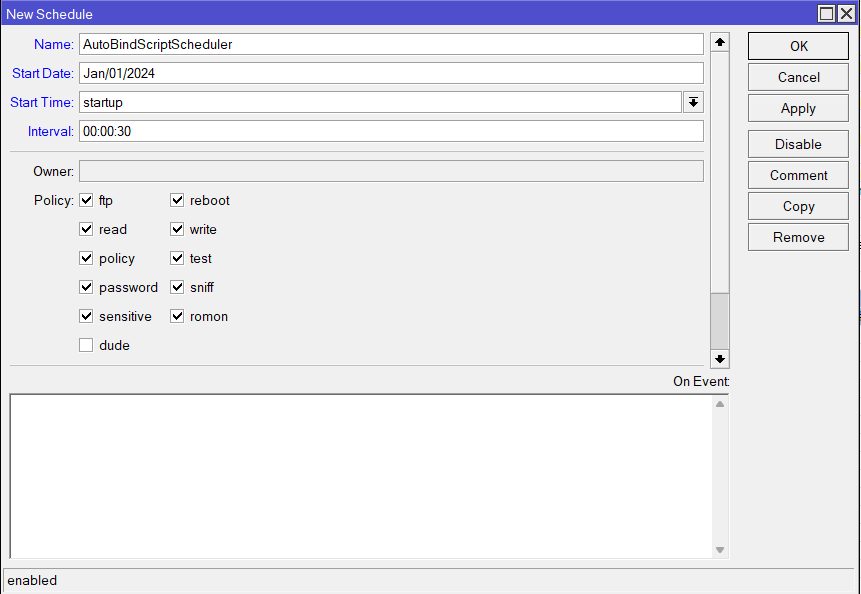

# 🤖 Auto Static Binding


The **Auto Bind Vendo Script** automatically assigns static IP addresses to NodeMCU devices (Vendo hardware) when they connect to your MikroTik DHCP server. This eliminates manual IP management and ensures each Vendo maintains a consistent IP address.

:::info
**Key Benefits:**
- ✅ Automatic IP assignment to NodeMCU devices
- ✅ Maintains consistent device identification
- ✅ Reduces manual configuration overhead
- ✅ Integrates with hotspot IP binding for access control

**Estimated Time:** 10-15 minutes
**Difficulty:** Intermediate
:::

---

## How It Works

### Workflow Diagram

1. **⏰ Scheduler Runs at Intervals**
   - A scheduler task runs every 30 seconds
   - Scans all DHCP servers in the system

2. **🔍 Identify Target Servers**
   - Finds DHCP servers with **no static addresses** already assigned
   - Skips servers in the exclusion list (e.g., "LAN")

3. **📝 Deploy Bind Script**
   - Injects the bind script to eligible DHCP servers
   - Script waits for NodeMCU device connections

4. **🖥️ NodeMCU Connection Detected**
   - When a NodeMCU connects, the lease script is triggered
   - Identifies the device by hostname (contains "WIZnet")

5. **🏷️ Assign Static IP**
   - Extracts the DHCP-assigned IP (e.g., `192.168.1.100`)
   - Replaces last octet with `vHost` value (default: `2`)
   - Results in static IP: `192.168.1.2`

6. **🔗 Create IP Binding**
   - Adds the device to hotspot IP binding
   - Enables MAC address-based access control
   - Logs success for troubleshooting

7. **🔄 Restart Required**
   - NodeMCU must restart to register new static IP
   - Ensures device connects with the correct IP

---

## Prerequisites

- ✅ MikroTik RouterOS with DHCP server configured
- ✅ NodeMCU/Vendo devices with network access
- ✅ Access to MikroTik terminal or admin console
- ✅ Understanding of basic scripting concepts

---

## Step 1: Create a New Scheduler

First, create a scheduler task that will manage the auto-bind script.

**Configuration Parameters:**
- **Name:** `Auto Bind Vendo` (or any descriptive name)
- **Start Date:** `Jan/01/2024` (any past date)
- **Start Time:** `startup` (runs when router boots)
- **Interval:** `00:00:30` (runs every 30 seconds)

:::tip
**Why 30 seconds?** This interval ensures new devices are detected quickly while minimizing system load.
:::



---

## Step 2: Configure the Scheduler Script

Copy the entire script below and paste it into the **"On Event"** field of your scheduler:

```bash
:local excludedServers {"LAN"};
:local script "\
    :local vHost \"2\";\r\
    \n\r\
    \n:local hN $\"lease-hostname\";\r\
    \n:local hM $\"leaseActMAC\";\r\
    \n:local hA $\"leaseActIP\";\r\
    \n:local sN $\"leaseServerName\";\r\
    \n\r\
    \n:local lI [/ip dhcp-server lease find where host-name=$hN];\r\
    \n\r\
    \n:if ($leaseBound = \"1\" && [:find $hN \"WIZnet\"] = 0) do={\r\
    \n    :log warning (\"Node Detected -> [ \" . $hN . \" ]-[ \" . $hM .  \" ]\");\r\
    \n\r\
    \n    :local nA ([pick $hA  0 [find $hA \".\" ([find $hA \".\" ([find $hA \".\"])+1)]+\
    1)  ]]. \".\" . $vHost);\r\
    \n\r\
    \n    :local eL [/ip dhcp-server lease find where address=$nA dynamic=no];\r\
    \n    :local eB [/ip hotspot ip-binding find where address=$nA];\r\
    \n\r\
    \n    :if ([:len $eL] = 0) do={\r\
    \n        :log warning (\"Node Static -> [ \" . $hA . \" ] to [ \" . $nA . \" ]\");\r\
    \n        /ip dhcp-server lease make-static $lI;\r\
    \n        /ip dhcp-server lease set $lI address=$nA mac-address=$hM comment=\"==> VENDO\";\r\
    \n        :log warning (\"Node Static -> Success\");\r\
    \n        /ip dhcp-server set [find name=$sN] lease-script=\"\";\r\
    \n        :log warning (\"Node Script -> Auto bind script removed from \" . $sN . \" server\");\r\
    \n    } else={\r\
    \n        :log error (\"Node Error -> Static \" . $nA . \" ip address already exists. Please remove it from the lease first!\");\r\
    \n        :return;\r\
    \n    }\r\
    \n\r\
    \n    :if ([:len $eB] = 0) do={\r\
    \n        :log warning (\"Node Binding -> [ \" . $nA . \" ] [ \" . $hM . \" ]\");\r\
    \n        /ip hotspot ip-binding add address=$nA to-address=$nA mac-address=$hM comment=\"==> VENDO\";\r\
    \n        :log warning (\"Node Binding -> Success\");\r\
    \n    } else={\r\
    \n        /ip hotspot ip-binding set $eB address=$nA to-address=$nA mac-address=$hM comment=\"==> VENDO\";\r\
    \n        :log warning (\"Node Binding -> Updated\");\r\
    \n    }\r\
    \n}\";\n\n:local dSrvs [/ip dhcp-server find];\n\n:foreach dSrv in=$dSrvs do={\n    :local dN [/ip dhcp-server get $dSrv name];\n    :if ([:find $excludedServers $dN] != 0) do={\n        :local dS [/ip dhcp-server get $dSrv lease-script];\n        :local dL [/ip dhcp-server lease find where server=$dN dynamic=no];\n\n        :if ([:len $dL] = 0) do={\n            :if ($dS = \"\") do={\n                /ip dhcp-server set $dSrv lease-script=$script;\n                :log info (\"Node Autobind -> script added to \" . $dN . \" server\");\n            }\n        }\n    }\n}
```

---

## Script Configuration Options

### Customize the Host Number

The last octet of the static IP is controlled by this line:

```bash
:local vHost \"2\";
```

**Examples:**
- `vHost = "2"` → Static IP ends in `.2` (e.g., `192.168.1.2`)
- `vHost = "100"` → Static IP ends in `.100` (e.g., `192.168.1.100`)
- `vHost = "250"` → Static IP ends in `.250` (e.g., `192.168.1.250`)

:::warning
**Important:** Ensure the host number doesn't conflict with other devices on your network. Recommended: Use `.2` - `.10` for management devices.
:::

### Exclude Additional DHCP Servers

To exclude multiple DHCP servers from auto-binding:

```bash
:local excludedServers {"LAN"; "GUEST"; "VENDO-BACKUP"};
```

Currently excluded: `"LAN"`

---

## Changing or Replacing a NodeMCU

### To Replace a Device:

1. **Remove the Static Lease**
   - Go to IP → DHCP Server → Leases
   - Find the old NodeMCU (marked with comment "==> VENDO")
   - Delete the static lease

2. **Remove IP Binding**
   - Go to IP → Hotspot → IP Binding
   - Find and remove the old device's binding

3. **Connect New NodeMCU**
   - Power on the new device
   - Connect to the DHCP server
   - Wait 30-60 seconds for the scheduler to detect

4. **Verify Assignment**
   - Check DHCP Leases for new static entry
   - Check IP Bindings for new device

5. **Restart New Device**
   - Reboot the NodeMCU to register new IP

---

## Important Notes

:::warning
**Critical Requirements:**
- The scheduler **must be running** and enabled
- DHCP servers targeted by the script should have **no pre-existing static addresses** (or it will skip them)
- The script looks for devices with **"WIZnet"** in their hostname - ensure your NodeMCU devices report this hostname
:::

:::info
**Script Behavior:**
- **First Device:** Script is added to DHCP server, static IP assigned
- **Subsequent Devices:** Script automatically manages new devices as they connect
- **Logs:** Check system logs in Terminal for detailed auto-bind activity
:::

---

## Verification & Troubleshooting

### Check if Script is Running

```bash
/ip dhcp-server print
```

Look for the `lease-script` field - should contain the auto-bind script.

### View Auto-Bind Logs

```bash
/log print where message~"Node"
```

**Healthy Output:**
```
Node Detected -> [NodeMCU-001]-[AA:BB:CC:DD:EE:FF]
Node Static -> [192.168.1.100] to [192.168.1.2]
Node Static -> Success
Node Binding -> [192.168.1.2] [AA:BB:CC:DD:EE:FF]
Node Binding -> Success
```

### Troubleshooting Table

| Issue | Cause | Solution |
|-------|-------|----------|
| **Script not running** | Scheduler disabled | Enable scheduler: `/system scheduler enable [number]` |
| **NodeMCU not detected** | Hostname doesn't contain "WIZnet" | Check device hostname, may need firmware update |
| **IP already exists error** | Static IP conflict | Remove existing lease with that IP |
| **No IP binding created** | Hotspot module not configured | Enable hotspot and verify IP binding permissions |
| **Device keeps changing IP** | Device not restarting | Manually restart NodeMCU after IP assignment |

---

## ✅ Complete!

Your auto-bind system is now active. New NodeMCU devices will automatically receive static IPs and be added to the hotspot binding system. Monitor the logs for the first 24 hours to ensure proper operation.
