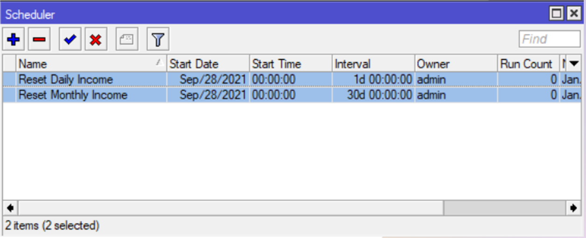
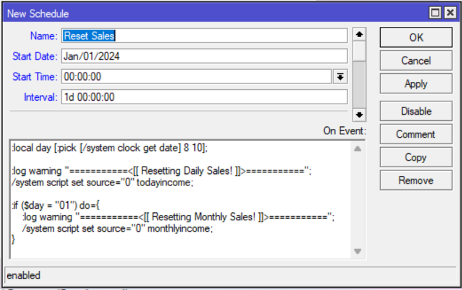

# 💰 Sales Reset


This guide explains how to set up automated daily and monthly sales reset for your JuanFi Vendo system. The script automatically resets income counters at midnight each day and on the first day of each month.

:::info
**Key Features:**
- ✅ Automatic daily sales reset at midnight
- ✅ Automatic monthly sales reset on the 1st of each month
- ✅ Detailed logging for audit trails
- ✅ Zero manual intervention required

**Estimated Time:** 5-10 minutes
**Difficulty:** Beginner-Intermediate
:::

---

## Prerequisites

- ✅ Access to MikroTik RouterOS terminal
- ✅ JuanFi system with `todayincome` and `monthlyincome` scripts
- ✅ System clock properly set on MikroTik
- ✅ Existing scheduler configuration (optional, we'll replace it)

---

## Step 1: Remove Old Schedulers

First, remove any outdated sales reset schedulers to avoid conflicts.

**Schedulers to Remove:**
- ❌ `Reset Daily Income`
- ❌ `Reset Monthly Income`
- ❌ Any other old sales-related schedulers

**How to Remove:**

1. Navigate to **System → Scheduler** in admin interface
2. Find the old schedulers in the list
3. Select and delete them

Or use terminal command:
```bash
/system scheduler remove [find name="Reset Daily Income"]
/system scheduler remove [find name="Reset Monthly Income"]
```



---

## Step 2: Create New Sales Reset Scheduler

Create a single consolidated scheduler that handles both daily and monthly resets.

### Option A: Terminal Command (Recommended)

Copy and paste this entire command into the MikroTik terminal:

```bash
/system scheduler add interval=1d name="Reset Sales" on-event=":local day [:pick [/system clock get date] 8 10];:log warning \"===========<[[ Resetting Daily Sales! ]]>===========\";/system script set source=\"0\" todayincome;:if (\$day = \"01\") do={:log warning \"===========<[[ Resetting Monthly Sales! ]]>===========\";/system script set source=\"0\" monthlyincome;}" policy=ftp,reboot,read,write,policy,test,password,sniff,sensitive,romon start-date=jan/01/2024 start-time=00:00:00
```

**What This Command Does:**
- Creates a new scheduler named "Reset Sales"
- Runs every 24 hours (1d interval)
- Resets `todayincome` script variable to "0" daily
- Checks if it's the 1st of the month
- Resets `monthlyincome` script variable to "0" on the 1st
- Logs all actions for audit trail

### Option B: Manual Configuration

If you prefer the GUI, use these settings:

**Basic Settings:**
| Parameter | Value |
|-----------|-------|
| **Name** | `Reset Sales` |
| **Start Date** | `Jan/01/2024` |
| **Start Time** | `00:00:00` |
| **Interval** | `1d` (1 day) |

**Script Content (On Event):**
```bash
:local day [:pick [/system clock get date] 8 10];
:log warning "===========<[[ Resetting Daily Sales! ]]>==========="  ;
/system script set source="0" todayincome;
:if ($day = "01") do={
    :log warning "===========<[[ Resetting Monthly Sales! ]]>===========" ;
    /system script set source="0" monthlyincome;
}
```

**Policy (Permissions Required):**
- `ftp` - File access
- `reboot` - Reboot permission
- `read` - Read data
- `write` - Write data
- `policy` - Modify policies
- `test` - Test commands
- `password` - Password handling
- `sniff` - Packet capture
- `sensitive` - Sensitive operations
- `romon` - Remote management



---

## How It Works

### Daily Reset (Runs at 00:00:00)

1. **Extract current date** → `day = 01` (if 1st of month) or `15` (if 15th), etc.
2. **Log action** → Writes "Resetting Daily Sales!" to system log
3. **Reset counter** → Sets `todayincome` script value to "0"
4. **Vendo displays** → Shows $0.00 daily income on next refresh

### Monthly Reset (Runs on 1st of month)

1. **Check if 1st** → `if ($day = "01")`
2. **Log action** → Writes "Resetting Monthly Sales!" to system log
3. **Reset counter** → Sets `monthlyincome` script value to "0"
4. **Vendo displays** → Shows $0.00 monthly income on next refresh

---

## Verification

After setting up the scheduler, verify it's working correctly:

### Check Scheduler Status

```bash
/system scheduler print
```

Should show:
- **Name:** "Reset Sales"
- **Interval:** "1d"
- **Next Run:** Tomorrow at 00:00:00
- **Disabled:** "false" (enabled)

### Check Logs

View recent activity logs:

```bash
/log print where message~"Reset"
```

**Expected Output:**
```
12:34:56 warning: ===========<[[ Resetting Daily Sales! ]]>===========
12:34:57 warning: /system/script: set todayincome=0

(On 1st of month:)
12:34:58 warning: ===========<[[ Resetting Monthly Sales! ]]>=========="
12:34:59 warning: /system/script: set monthlyincome=0
```

### Manual Test

To manually trigger the scheduler for testing:

```bash
/system scheduler run [find name="Reset Sales"]
```

Check logs immediately after to confirm it executed.

---

## Troubleshooting

| Issue | Cause | Solution |
|-------|-------|----------|
| **Scheduler doesn't run** | Disabled scheduler | Enable: `/system scheduler enable [number]` |
| **Sales not resetting** | Incorrect script names | Verify scripts are named `todayincome` and `monthlyincome` |
| **Wrong reset time** | System clock not set | Set correct time: `/system clock set time=HH:MM:SS` |
| **Monthly reset not working** | Date format mismatch | Verify date format in logs: `[/system clock get date]` |
| **Multiple resets happening** | Duplicate schedulers | Check all schedulers: `/system scheduler print` |

---

## Advanced: Understanding the Script

### Extract Day of Month
```bash
:local day [:pick [/system clock get date] 8 10];
```
- Extracts characters 8-10 from date string (e.g., "jan/01/2024" → "01")
- Allows checking if it's the 1st of the month

### Reset Script Variables
```bash
/system script set source="0" todayincome;
```
- Sets the `todayincome` script's source/value to "0"
- Resets the income counter for display on Vendo devices

### Conditional Monthly Reset
```bash
:if ($day = "01") do={ ... }
```
- Only executes monthly reset if the day equals "01"
- Prevents unnecessary monthly resets on other days

---

## ✅ Complete!

Your automated sales reset system is now active. The system will:
- 🔄 Reset daily income every midnight
- 🔄 Reset monthly income on the 1st of each month
- 📝 Log all resets for audit purposes
- ⚡ Require zero manual intervention

Monitor the logs over the next few days to ensure proper operation.
