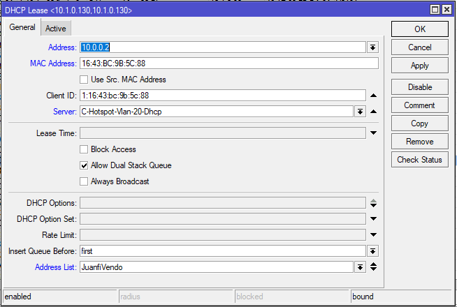
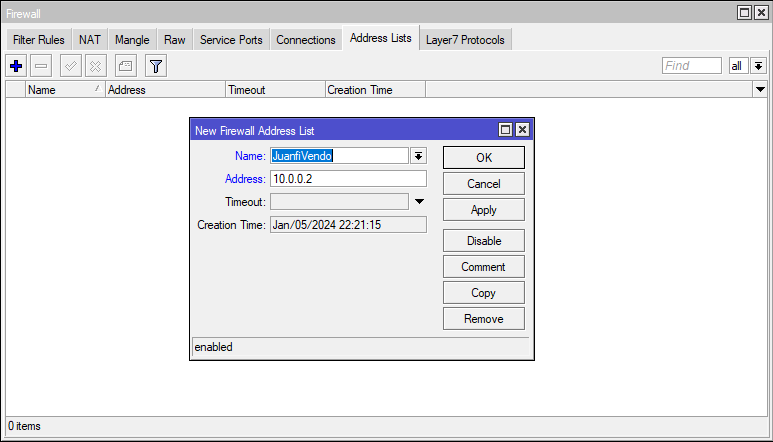

# 📋 VENDO ADDRESS LIST

## Overview

An **Address List** in MikroTik is a dynamic collection of IP addresses that can be referenced in firewall rules. Creating an address list for your Vendo machines allows you to:
- ✅ Apply consistent firewall rules to all Vendos
- ✅ Manage traffic permissions centrally
- ✅ Simplify network administration
- ✅ Enable QoS (Quality of Service) policies

:::info
**Estimated Time:** 5-10 minutes per address list
**Difficulty:** Beginner
:::

---

## Prerequisites

- ✅ Access to MikroTik RouterOS admin console
- ✅ IP addresses of all your Vendo machines
- ✅ Basic understanding of MikroTik interface

---

## Step 1: Add Vendo IP Addresses to Address List

You have two options to add Vendo IP addresses to the address list:

### Option A: Dynamic/GUI Method

Use the MikroTik admin interface to add addresses dynamically:

**Configuration:**
- **Address:** `<vendo_ip_address>`
- **Address List:** `JuanfiVendo`
- **Comment:** (Optional) Add vendo name or location for reference

:::tip
**Tip:** Use descriptive comments like "Vendo-Front-Desk" or "Vendo-Entrance" to identify each Vendo location.
:::



### Option B: Terminal/Script Method

For each Vendo IP, execute this command in the terminal:

```bash
/ip firewall address-list add address=<vendo_ip_address> list=JuanfiVendo comment="Vendo Location"
```

**Example:**
```bash
/ip firewall address-list add address=192.168.1.50 list=JuanfiVendo comment="Vendo-Front"
/ip firewall address-list add address=192.168.1.51 list=JuanfiVendo comment="Vendo-Back"
```



---

## Step 2: Apply Walled Garden Rules

The **Walled Garden** feature allows certain devices to access specific services (like login pages) before hot spot authentication.

**Execute this command:**

```bash
/ip hotspot walled-garden ip add action=accept disabled=no dst-address-list=JuanfiVendo
```

**What this does:**
- Permits Vendo devices to bypass hotspot authentication for admin access
- Ensures Vendos can communicate with the management system
- Allows time synchronization and updates

---

## Step 3: Configure Firewall Filter Rule

This firewall filter allows incoming traffic to Vendo devices:

**Execute this command:**

```bash
/ip firewall filter add action=accept chain=input place-before=0 comment=JuanfiVendo src-address-list=JuanfiVendo
```

**What this does:**
- Accepts all incoming packets from Vendo addresses
- Places rule at the top (highest priority) of the input chain
- Enables communication with Vendo devices over the network

:::warning
**Important:** The `place-before=0` parameter places this rule at the top. If you have other critical rules, adjust this parameter accordingly.
:::

---

## Verification

After completing these steps, verify your configuration:

✅ **Check Address List:**
```bash
/ip firewall address-list print
```
Should show all your Vendo IPs in the `JuanfiVendo` list

✅ **Check Walled Garden:**
```bash
/ip hotspot walled-garden ip print
```
Should show `JuanfiVendo` in the list

✅ **Check Firewall Rules:**
```bash
/ip firewall filter print
```
Should show the JuanfiVendo input rule at the top

---

## Troubleshooting

| Issue | Solution |
|-------|----------|
| **Vendo can't access network** | Verify all Vendo IPs are in the address list, check firewall rules aren't blocking traffic |
| **Duplicate addresses in list** | Use `/ip firewall address-list print` to check, remove duplicates manually |
| **Vendo still requires authentication** | Ensure walled garden rule is enabled and references `JuanfiVendo` list |

---

## ✅ Complete!

Your Vendo address list is now configured. You can now reference `JuanfiVendo` in other firewall rules, QoS policies, and management scripts.
