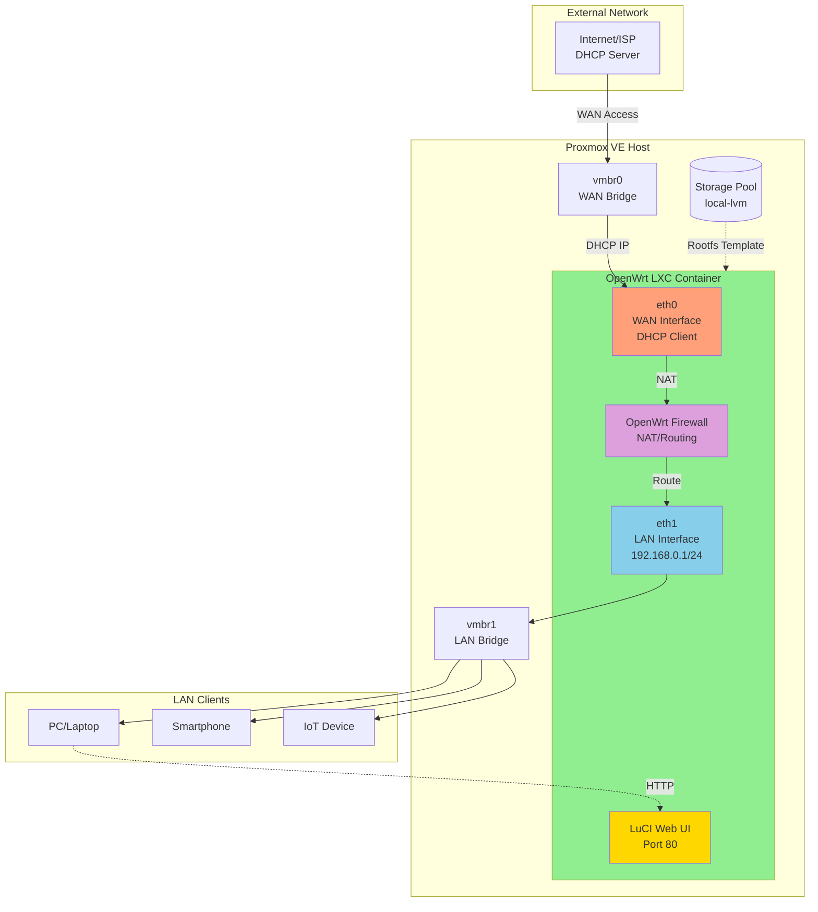

# 🌐 Install OpenWrt LXC

Automate the deployment of OpenWrt containers in Proxmox VE with this interactive script that handles rootfs download, network configuration, storage allocation, and optional LuCI web interface installation. Supports both stable releases and daily snapshot builds for x86_64 architecture.

:::info Key Features
- **Auto-Detection** - Fetches latest OpenWrt stable or snapshot releases automatically
- **Interactive Setup** - Whiptail menus for storage, network, resources, and configuration
- **Dual Network** - WAN (DHCP) and LAN (static IP) with bridge or physical device support
- **LuCI Installation** - Optional web UI for snapshot builds during setup
- **Smart Validation** - Protects against duplicate CTIDs and invalid network inputs
- **Template Refresh** - Automatically updates outdated snapshot templates (>1 day old)
:::

## Prerequisites

Before deploying OpenWrt LXC containers, ensure you have:

✅ **Proxmox VE** - Version 7.0 or higher  
✅ **Root Access** - Script requires root privileges on Proxmox host  
✅ **Network Bridges** - At least one vmbr configured (e.g., vmbr0 for WAN)  
✅ **Storage Pool** - Available storage with >1GB free space  
✅ **Internet Connection** - For downloading OpenWrt rootfs templates  
✅ **Dependencies** - wget, curl, whiptail, pve-container, bridge-utils, bc

:::warning Important Considerations
- Only x86_64 OpenWrt images are supported (no ARM/MIPS)
- Snapshot builds use apk package manager instead of opkg (Alpine-based)
- LAN subnet prefix must be /16, /22, /23, or /24 (other sizes not supported)
- Container is unprivileged by default with nesting enabled
- WAN interface requires DHCP server on network (no static WAN option in script)
- Snapshot templates older than 1 day are automatically re-downloaded
- Existing CTIDs will be rejected to prevent accidental overwrite
:::

## Configuration Steps

### Option A: One-Liner Installation

```bash
# Install required dependencies first
apt update
apt install wget curl whiptail pve-container pve-manager bridge-utils bc -y

# Download and execute OpenWrt LXC creation script
bash -c "$(curl -fsSL https://raw.githubusercontent.com/Kintoyyy/openwrt-proxmox-lxc/main/install.sh)"

# Interactive prompts will guide you through:
# 1. Choose OpenWrt version (Stable or Snapshot)
# 2. Select storage pool for container
# 3. Configure WAN interface (bridge or none)
# 4. Configure LAN interface (bridge or none)
# 5. Set container ID, name, memory, CPU, storage
# 6. Configure LAN subnet and root password
# 7. Optional LuCI installation for snapshots

# Script will display summary and ask for confirmation before creating
```

### Option B: Manual Clone and Run

```bash
# Clone the repository
git clone https://github.com/Kintoyyy/openwrt-proxmox-lxc.git
cd openwrt-proxmox-lxc

# Review script before execution
cat install.sh

# Make script executable
chmod +x install.sh

# Run script as root
./install.sh

# Follow interactive prompts:
# - Stable Release: Enter version (e.g., 23.05.2) or auto-detect latest
# - Snapshot: Uses daily build, prompts for LuCI installation
# - WAN/LAN: Select from available bridges (vmbr0, vmbr1, etc.)
# - Resources: Memory (default 256MB), CPU (default 2), Storage (default 0.5GB)
# - Network: LAN IP/subnet (default 192.168.0.1/24)

# After creation, access container shell
pct exec <CTID> /bin/sh

# Check network configuration
uci show network

# Access LuCI web interface (if LAN configured)
# http://192.168.0.1 (or your configured LAN IP)
```

## Understanding the Configuration



### Component Relationships

| Component | Purpose | Network Configuration |
|-----------|---------|----------------------|
| **WAN Interface (eth0)** | Uplink to Internet/ISP, gets IP via DHCP | DHCPv4 + DHCPv6 client, attached to vmbr0 (default) |
| **LAN Interface (eth1)** | Internal network for clients, static IP | 192.168.0.1/24 (configurable), DHCP server enabled |
| **OpenWrt Firewall** | NAT, routing, firewall rules between WAN/LAN | Default zones: WAN (input reject) → LAN (accept) |
| **LuCI Web Interface** | Web-based management UI | HTTP on port 80 (LAN IP), optional installation |
| **Storage Pool** | Container rootfs storage | local-lvm, local, or custom pool (0.5GB default) |
| **Network Bridges** | Proxmox network abstraction | vmbr0 (WAN), vmbr1 (LAN), or physical devices |
| **Container Type** | Unprivileged LXC with nesting | Enables Docker/nested containers if needed |
| **Package Manager** | Software installation tool | opkg (stable), apk (snapshot/Alpine-based) |

### Script Operations

| Action | Description | Example |
|--------|-------------|---------|
| **Version Detection** | Fetches latest stable/snapshot from OpenWrt downloads | Auto-detects 23.05.5 or daily snapshot |
| **Template Download** | Retrieves x86_64 rootfs tarball | `wget https://downloads.openwrt.org/.../rootfs.tar.gz` |
| **Container Creation** | Creates unprivileged LXC with specified resources | `pct create <CTID> --storage --memory 256 --cores 2` |
| **Network Setup** | Configures UCI network interfaces | WAN: DHCP, LAN: static with dnsmasq |
| **LuCI Installation** | Installs web UI packages (optional for snapshots) | `apk add luci` or `opkg install luci` |
| **Template Refresh** | Re-downloads snapshot if >1 day old | Checks mtime of cached template file |

## Verification

Test the OpenWrt LXC deployment with these commands:

**1. Check Container Status:**
```bash
pct status <CTID>
# Expected: status: running
# Verify container is started

pct list | grep <CTID>
# Expected: CTID listed with status "running"
```

**2. Verify Container Configuration:**
```bash
pct config <CTID>
# Check memory, cores, storage allocation
# Verify network interfaces (net0: WAN, net1: LAN)

# Expected output includes:
# cores: 2
# memory: 256
# net0: name=eth0,bridge=vmbr0
# net1: name=eth1,bridge=vmbr1
```

**3. Access Container Shell:**
```bash
pct exec <CTID> /bin/sh
# Should drop into OpenWrt shell

# Check OpenWrt version
cat /etc/openwrt_release
# Expected: DISTRIB_RELEASE="23.05.2" or "SNAPSHOT"
```

**4. Test Network Configuration:**
```bash
# From container shell
uci show network

# Expected WAN (eth0) config:
# network.wan.device='eth0'
# network.wan.proto='dhcp'

# Expected LAN (eth1) config:
# network.lan.device='eth1'
# network.lan.proto='static'
# network.lan.ipaddr='192.168.0.1'
# network.lan.netmask='255.255.255.0'
```

**5. Verify WAN Connectivity:**
```bash
# From container shell
ip addr show eth0
# Should show DHCP-assigned IP address

ping -c 3 8.8.8.8
# Expected: 0% packet loss
# Confirms WAN interface has Internet access

# Test DNS resolution
nslookup google.com
# Expected: Resolved IP address
```

**6. Test LAN Interface:**
```bash
# From container shell
ip addr show eth1
# Expected: inet 192.168.0.1/24

# Check DHCP server (dnsmasq)
ps | grep dnsmasq
# Expected: dnsmasq process running on LAN interface
```

**7. Access LuCI Web Interface:**
```bash
# From Proxmox host or LAN client
curl -I http://192.168.0.1
# Expected: HTTP/1.1 200 OK (if LuCI installed)
# Or: Connection refused (if LuCI not installed)

# Access via browser: http://192.168.0.1
# Login with root password (set during installation)
```

**8. Verify Package Manager:**
```bash
# From container shell

# For Stable releases:
opkg --version
opkg update
opkg list | head

# For Snapshot releases:
apk --version
apk update
apk list | head
```

## Troubleshooting

| Issue | Cause | Solution |
|-------|-------|----------|
| **"Container ID already exists"** | CTID in use or reserved | Choose different CTID: `pct list` to see used IDs, use `pct destroy <CTID>` if safe to remove |
| **WAN interface no IP address** | DHCP server unavailable on bridge | Check Proxmox network: `ip addr show vmbr0`, verify router DHCP, check WAN logs: `pct exec <CTID> logread \| grep dhcp` |
| **Cannot access LuCI web interface** | LuCI not installed or firewall blocking | Install LuCI: `pct exec <CTID> opkg install luci`, restart services: `pct exec <CTID> /etc/init.d/uhttpd restart`, check firewall: `iptables -L -n` |
| **"No space left on device"** | Storage pool full or quota exceeded | Check storage: `pvesm status`, increase container disk: `pct resize <CTID> rootfs +1G`, clean old templates: `rm /var/lib/vz/template/cache/openwrt-*` |
| **LAN clients can't get DHCP** | dnsmasq not running or bridge misconfigured | Start dnsmasq: `pct exec <CTID> /etc/init.d/dnsmasq start`, check config: `uci show dhcp`, verify bridge: `brctl show vmbr1` |
| **Snapshot template download fails** | Network issue or OpenWrt server down | Check connection: `curl -I https://downloads.openwrt.org`, manually download: `wget https://downloads.openwrt.org/snapshots/targets/x86/64/openwrt-*-rootfs.tar.gz` |
| **"whiptail: command not found"** | Missing dependency package | Install whiptail: `apt install whiptail -y`, or use dialog: `apt install dialog && ln -s /usr/bin/dialog /usr/bin/whiptail` |
| **Network interfaces not appearing** | Nesting not enabled or missing bridge | Enable nesting: `pct set <CTID> -features nesting=1`, restart container: `pct restart <CTID>`, verify bridges: `ip link show type bridge` |
| **"Invalid subnet prefix"** | Unsupported CIDR notation used | Use supported prefixes: /16, /22, /23, or /24 only, correct in UCI: `uci set network.lan.netmask='255.255.255.0' && uci commit network` |
| **Root password not working** | Password not set or reset required | Set password: `pct exec <CTID> passwd`, or edit shadow file: `pct exec <CTID> vi /etc/shadow` |
| **Container fails to start** | Configuration error or resource limits | Check logs: `journalctl -u pve-container@<CTID> -n 50`, verify config: `pct config <CTID>`, increase resources: `pct set <CTID> -memory 512` |
| **opkg update fails (stable)** | Repository URL incorrect or network issue | Check repos: `cat /etc/opkg/distfeeds.conf`, fix URLs manually, test connection: `wget http://downloads.openwrt.org/releases/` |
| **apk update fails (snapshot)** | Alpine mirror unavailable | Change mirror: `echo "https://dl-cdn.alpinelinux.org/alpine/edge/main" > /etc/apk/repositories`, update cache: `apk update --allow-untrusted` |
| **No Internet from LAN clients** | NAT/masquerading not configured | Enable masquerading: `uci set firewall.@zone[1].masq='1' && uci commit firewall`, restart firewall: `/etc/init.d/firewall restart` |
| **Bridge not found during setup** | Proxmox network not configured | Create bridge: `pvesh create /nodes/\$(hostname)/network --iface vmbr1 --type bridge --bridge_ports none`, apply network: `ifreload -a` |

## Advanced Options

### 1. Custom LAN Subnet Configuration
```bash
# After container creation, change LAN network
pct exec <CTID> /bin/sh

# Set custom LAN subnet (e.g., 10.0.0.1/24)
uci set network.lan.ipaddr='10.0.0.1'
uci set network.lan.netmask='255.255.255.0'
uci commit network

# Update DHCP range
uci set dhcp.lan.start='100'
uci set dhcp.lan.limit='150'
uci commit dhcp

# Restart network services
/etc/init.d/network restart
/etc/init.d/dnsmasq restart
```

### 2. Static WAN Configuration
```bash
# Change WAN from DHCP to static IP
pct exec <CTID> /bin/sh

uci set network.wan.proto='static'
uci set network.wan.ipaddr='203.0.113.50'
uci set network.wan.netmask='255.255.255.0'
uci set network.wan.gateway='203.0.113.1'
uci set network.wan.dns='8.8.8.8 8.8.4.4'
uci commit network

/etc/init.d/network restart
```

### 3. Multiple WAN Interfaces (Multi-WAN)
```bash
# Add second WAN interface via Proxmox
pct set <CTID> -net2 name=eth2,bridge=vmbr2,firewall=1

# Configure in OpenWrt
pct exec <CTID> /bin/sh

uci set network.wan2=interface
uci set network.wan2.device='eth2'
uci set network.wan2.proto='dhcp'

# Add to WAN firewall zone
uci add_list firewall.@zone[1].network='wan2'
uci commit network
uci commit firewall

/etc/init.d/network restart
/etc/init.d/firewall restart
```

### 4. VLAN Configuration
```bash
# Create VLAN 10 on LAN interface
pct exec <CTID> /bin/sh

uci set network.vlan10=device
uci set network.vlan10.type='8021q'
uci set network.vlan10.ifname='eth1'
uci set network.vlan10.vid='10'

uci set network.guest=interface
uci set network.guest.device='eth1.10'
uci set network.guest.proto='static'
uci set network.guest.ipaddr='192.168.10.1'
uci set network.guest.netmask='255.255.255.0'

uci commit network
/etc/init.d/network restart
```

### 5. Install Additional Packages
```bash
# For Stable releases
pct exec <CTID> /bin/sh

opkg update
opkg install luci-app-sqm       # QoS/SQM
opkg install luci-app-wireguard # WireGuard VPN
opkg install adblock            # Ad blocking
opkg install htop iperf3        # Monitoring tools

# For Snapshot releases
apk update
apk add luci-app-sqm
apk add luci-app-wireguard
apk add adblock
apk add htop iperf3
```

### 6. Enable IPv6
```bash
# Configure IPv6 on WAN
pct exec <CTID> /bin/sh

uci set network.wan6=interface
uci set network.wan6.device='@wan'
uci set network.wan6.proto='dhcpv6'

# Enable IPv6 on LAN
uci set network.lan.ip6assign='60'

uci commit network
/etc/init.d/network restart

# Install IPv6 firewall rules
opkg install ip6tables
/etc/init.d/firewall restart
```

### 7. Wireless Access Point Configuration
```bash
# Add USB WiFi adapter to container
pct set <CTID> -usb0 host=1-1.2

# Install wireless packages
pct exec <CTID> opkg install kmod-mac80211 kmod-ath9k wpad-basic-mbedtls

# Configure wireless
uci set wireless.radio0.disabled='0'
uci set wireless.@wifi-iface[0].ssid='OpenWrt-AP'
uci set wireless.@wifi-iface[0].encryption='psk2'
uci set wireless.@wifi-iface[0].key='YourPassword123'
uci set wireless.@wifi-iface[0].network='lan'
uci commit wireless

wifi up
```

### 8. Port Forwarding Rules
```bash
# Forward external port 2222 to LAN device SSH (port 22)
pct exec <CTID> /bin/sh

uci add firewall redirect
uci set firewall.@redirect[-1].src='wan'
uci set firewall.@redirect[-1].src_dport='2222'
uci set firewall.@redirect[-1].dest='lan'
uci set firewall.@redirect[-1].dest_ip='192.168.0.100'
uci set firewall.@redirect[-1].dest_port='22'
uci set firewall.@redirect[-1].proto='tcp'
uci commit firewall

/etc/init.d/firewall restart
```

### 9. Backup and Restore Configuration
```bash
# Backup configuration
pct exec <CTID> sysupgrade -b /tmp/backup.tar.gz
pct pull <CTID> /tmp/backup.tar.gz ./openwrt-backup-$(date +%Y%m%d).tar.gz

# Restore configuration
pct push <CTID> ./openwrt-backup-20260131.tar.gz /tmp/backup.tar.gz
pct exec <CTID> sysupgrade -r /tmp/backup.tar.gz

# Or use LuCI: System > Backup / Flash Firmware
```

### 10. Increase Container Resources
```bash
# Increase memory to 512MB
pct set <CTID> -memory 512

# Increase CPU cores to 4
pct set <CTID> -cores 4

# Increase storage to 2GB
pct resize <CTID> rootfs 2G

# Apply changes (restart required)
pct restart <CTID>

# Verify new resources
pct config <CTID>
```

### 11. Clone Container for Testing
```bash
# Stop source container
pct stop <CTID>

# Clone to new CTID
pct clone <CTID> <NEW_CTID> --full --description "OpenWrt Test Clone"

# Modify cloned container network to avoid IP conflicts
pct set <NEW_CTID> -net1 name=eth1,bridge=vmbr2

# Start cloned container
pct start <NEW_CTID>

# Change LAN IP in cloned container
pct exec <NEW_CTID> uci set network.lan.ipaddr='192.168.1.1'
pct exec <NEW_CTID> uci commit network
pct exec <NEW_CTID> /etc/init.d/network restart
```

### 12. Automated Backup Script
```bash
# Create backup script on Proxmox host
cat > /usr/local/bin/backup-openwrt.sh << 'EOF'
#!/bin/bash
CTID=$1
BACKUP_DIR="/var/backups/openwrt"
DATE=$(date +%Y%m%d_%H%M%S)

mkdir -p $BACKUP_DIR

# Backup OpenWrt config
pct exec $CTID sysupgrade -b /tmp/backup.tar.gz
pct pull $CTID /tmp/backup.tar.gz $BACKUP_DIR/openwrt-$CTID-$DATE.tar.gz
pct exec $CTID rm /tmp/backup.tar.gz

# Keep only last 7 backups
find $BACKUP_DIR -name "openwrt-$CTID-*.tar.gz" -mtime +7 -delete

echo "Backup completed: $BACKUP_DIR/openwrt-$CTID-$DATE.tar.gz"
EOF

chmod +x /usr/local/bin/backup-openwrt.sh

# Schedule daily backups
(crontab -l 2>/dev/null; echo "0 3 * * * /usr/local/bin/backup-openwrt.sh <CTID>") | crontab -

# Run backup manually
/usr/local/bin/backup-openwrt.sh <CTID>
```

## Related Guides

- [Post-Install Configuration](./post-install-configuration) - Proxmox host optimization before container deployment
- [Install MikroTik CHR](./install-mikrotik-chr) - Alternative router VM for Proxmox
- [GenieACS Auto Installer](./genieacs-auto-installer) - TR-069 management for OpenWrt CPE devices

## Completion

🎉 **Deployment Complete!**

Your OpenWrt LXC container is now operational with:
- ✅ Lightweight container with minimal resource usage
- ✅ WAN interface with DHCP connectivity to Internet
- ✅ LAN interface with static IP and DHCP server
- ✅ OpenWrt firewall with NAT/routing between zones
- ✅ Optional LuCI web interface for management

**Next Steps:**
1. Access container shell: `pct exec <CTID> /bin/sh`
2. Verify network config: `uci show network`
3. Access LuCI web UI: `http://192.168.0.1` (change admin password)
4. Install additional packages: `opkg update && opkg install <package>`
5. Configure firewall rules for port forwarding
6. Set up backup schedule with provided script (Advanced Option 12)
7. Consider enabling IPv6 (Advanced Option 6)

**Management Commands Reference:**
```bash
pct start <CTID>           # Start container
pct stop <CTID>            # Stop container
pct restart <CTID>         # Restart container
pct exec <CTID> /bin/sh    # Access shell
pct config <CTID>          # View configuration
uci show network           # Show network config (inside container)
/etc/init.d/network restart # Restart networking (inside container)
```

**Common OpenWrt Commands:**
```bash
uci show                   # Show all UCI configuration
uci changes                # Show pending changes
uci commit                 # Commit all changes
logread                    # View system logs
top                        # Monitor resource usage
opkg list-installed        # List installed packages (stable)
apk info                   # List installed packages (snapshot)
```
